<div align="center">

# 🦾 TeammateX

### The self-hosted AI teammate that onboards itself into your engineering team.

It clones your repositories, reads every line and every commit, builds a living knowledge graph of your codebase, and then shows up as a real team member — answering questions, tracing bugs to their owner, writing code, opening pull requests, running standups, and plugging into GitHub, Jira, and Slack.

<br/>

<!-- What it is -->


<!-- CI / CD -->
[](https://github.com/raiyanyahya/teammatex/actions/workflows/ci.yml)
[](https://github.com/raiyanyahya/teammatex/actions/workflows/codeql.yml)
[](https://github.com/raiyanyahya/teammatex/actions/workflows/docker.yml)

<!-- Project status -->


<!-- Stack -->


<br/>

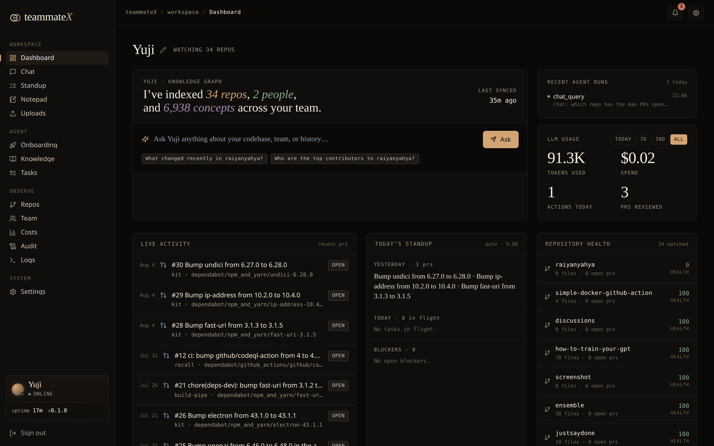

</div>

---

> [!NOTE]
> **TeammateX is in alpha — early and moving fast.**
> It runs end-to-end and the features below are real, but expect rough edges, breaking changes, and incomplete corners. Pin a commit if you deploy it, keep backups of the named volumes, and treat it as a capable work-in-progress rather than a hardened product. **Bug reports, ideas, and PRs are hugely welcome** — this is the stage where they shape the project most.

---

## Table of contents

- [Why TeammateX](#-why-teammatex)
- [What it does (the 30-second version)](#-what-it-does-the-30-second-version)
- [Quickstart (local, 3 commands)](#-quickstart-local-3-commands)
- [Every feature, explained](#-every-feature-explained)
- [Architecture](#-architecture)
- [The agent's toolbox (28 tools)](#-the-agents-toolbox)
- [Installing on a server (production)](#-installing-on-a-server-production)
- [Configuration reference](#-configuration-reference-env)
- [Security](#-security)
- [Development](#-development)
- [API overview](#-api-overview)
- [FAQ](#-faq)
- [License](#-license)
- [Contributing](#-contributing)

---

## ✨ Why TeammateX

Onboarding a new engineer takes weeks: they have to read the code, learn the history, figure out who owns what, and build a mental model of how everything connects. **TeammateX does that work once, automatically, and never forgets.**

Instead of a chatbot that hallucinates about a codebase it has never seen, TeammateX is grounded in *your* code:

- It **actually clones and parses** your repos (tree-sitter, multi-language).
- It builds a **knowledge graph** of files, functions, classes, modules, call edges, and human ownership — mined from real git history.
- It generates **vector embeddings** so it can answer "where do we handle billing webhooks?" with the real file, not a guess.
- It runs **on your infrastructure**. Your code never leaves your servers. Bring your own LLM key (or run a local model with Ollama).

The result is a teammate that can say *"that retry logic lives in `queue/consumer.py:142`, Maya owns it, and it's called from three places — here's the one that can deadlock,"* and back every claim with a graph lookup.

---

## 🚀 What it does (the 30-second version)

| | |
|---|---|
| 🧠 **Learns your codebase** | Clones repos, parses with tree-sitter, embeds into pgvector, graphs into Neo4j |
| 💬 **Answers grounded questions** | Chat agent with 28 tools — semantic search, graph queries, blame, ownership |
| 🔧 **Writes & ships code** | Reads/edits files, runs tests & lint, creates branches, opens real PRs via `gh` |
| 🕸️ **Maps ownership & dependencies** | "Who owns this?" / "What calls this?" answered from the graph, not vibes |
| 📋 **Runs the rituals** | Standup, task board, weekly digest — as deterministic product surfaces, not chat |
| 🔌 **Integrates** | GitHub (PRs, repos, webhooks), Jira (boards/sprints), Slack (channels, posts) |
| 📊 **Stays observable** | Costs, audit trail, live container logs, Prometheus + Grafana + Loki |
| 🗂️ **Gives each dev a workspace** | Per-user autosaving notepad + private file uploads |
| 🔒 **Self-hosted & private** | Your servers, your LLM key, cookie-gated API, nothing phones home |

---

## ⚡ Quickstart (local, 2 steps)

> **Requirements:** Docker + Docker Compose v2, ~6 GB free RAM, and one LLM API key (DeepSeek, OpenAI, Anthropic, Groq — or a local Ollama model).

```bash
# 1. Clone and configure
git clone <your-fork-url> teammatex && cd teammatex
cp .env.example .env          # then edit .env — at minimum set TEAMMATEX_SECRET_KEY + one LLM key

# 2. Launch the whole stack (api, worker, frontend, postgres, neo4j, redis, caddy…)
#    A one-shot `migrate` service runs the DB migrations automatically before
#    the API starts — no manual step.
docker compose up -d --build
```

Then open **http://localhost:3000** (or **https://localhost** through Caddy).

**First login:** on first run a default admin (`admin@teammatex.local`) is created and its **one-time password is printed in the API logs**:

```bash
docker compose logs api | grep -A4 "first run"
```

Log in, then walk the dashboard's 4-step onboarding: **name your teammate → add an LLM key → connect GitHub → add repositories.** Within minutes your teammate has read its first repo.

---

## 🧩 Every feature, explained

### 1. The AI teammate — chat + agentic tools

The heart of the product. The **Chat** page is a streaming conversation with an agent that runs a real tool loop: it thinks, calls a tool, reads the result, and keeps going until it can answer — exactly like a senior engineer with a terminal.

- **Grounded, not guessing.** Before answering it can `semantic_search` your embeddings, `graph_query` the knowledge graph, `find_owner` of a file, or `get_blame` on a line.
- **Acts, doesn't just talk.** It can `read_file` / `edit_file`, `run_tests`, `run_lint`, `create_branch`, `commit_files`, and `create_pr` — it runs `git` and `gh` itself rather than following a scripted workflow.
- **Persistent memory.** `write_note` / `search_notes` give the team a durable, searchable memory that survives across conversations and is linked into the graph.
- **Rich, readable replies.** Answers render as full Markdown with **syntax-highlighted** code blocks (Shiki), and every code block — and message — has a one-click **copy** button. A **Stop** button cancels a running response mid-stream.
- **Conversation history.** Threads are persisted server-side and listed in a sidebar, so you can reopen past discussions across devices and start a fresh one any time — the agent's memory now extends to the chat itself. **Search** across every thread's title and message text, and **export** any conversation to Markdown with one click.
- **Attach a file.** Pull one of your private **uploads** straight into a message; its text is injected inline as context, so the agent can reason over a stack trace, log, or design doc alongside your code.
- **Configurable brain.** Pick your provider/model per deployment. DeepSeek is the cost-effective default; OpenAI, Anthropic, Groq, and local **Ollama** are all supported via LiteLLM.
- **Persona.** Give the teammate a name (e.g. "Yuji") and a working style.

> Capability cards on the empty state make the non-obvious powers discoverable: *"Who owns the billing module?"*, *"Trace this issue"*, *"Summarize this week's PRs."*

<p align="center">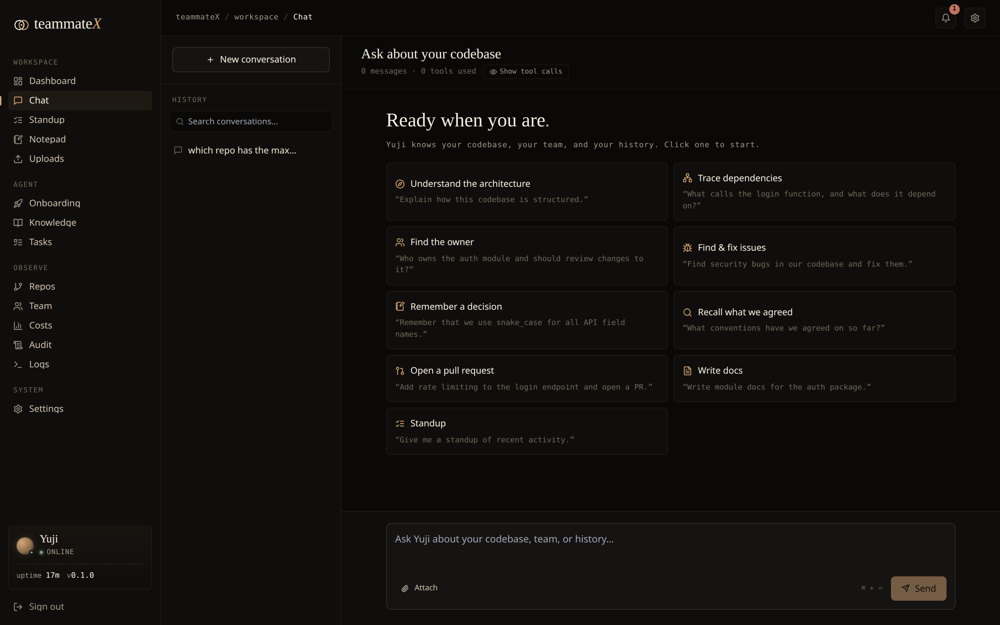</p>

### 2. Repository onboarding — the pipeline

Adding a repo kicks off a Celery pipeline that turns source code into queryable knowledge:

1. **Clone** — `git clone` into `/data/repos/<name>`.
2. **Parse** — tree-sitter walks every file and extracts functions, classes, modules, and **call edges** across Python, JavaScript/TypeScript, Go, Rust, Java, and more.
3. **Embed** — code chunks are vectorized into **pgvector**. Default embeddings are **local** (`all-MiniLM-L6-v2`, 384-dim, zero cost, nothing leaves the box); switch to OpenAI embeddings with one env var.
4. **Graph** — files/modules/functions/classes/concepts become nodes in **Neo4j**, wired with `PART_OF`, `CALLS`, and `OWNS` edges.
5. **History mining** — git history is mined for **ownership** (who has touched each file most) and **pull requests** are pulled from the GitHub API and reconciled into the DB.

Progress is shown per-stage on the **Onboarding** page with real status (not fake checkmarks). Failed stages can be retried. You can onboard one URL at a time, or click **"Browse my repositories"** to bulk-select from your GitHub account (forks and archived repos are auto-unchecked).

<p align="center">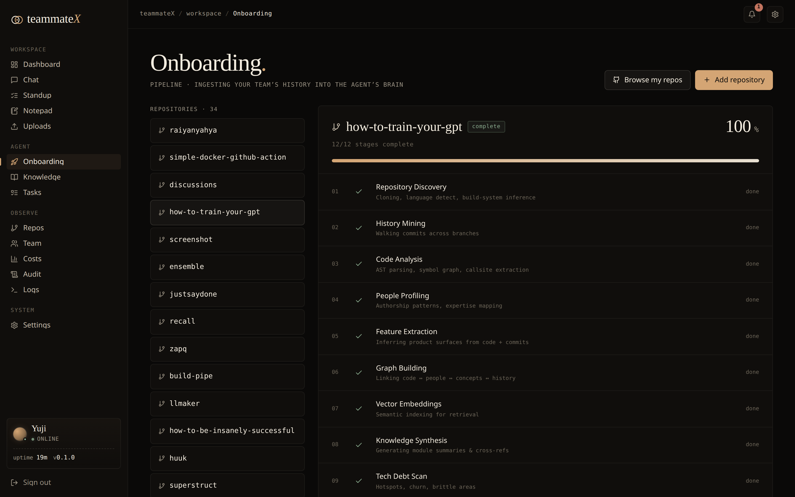</p>

### 3. The knowledge graph

A Neo4j graph is the teammate's structural memory. Node types: **Repository, Module, File, Function, Class, Concept, Contributor.** Edge types:

- **`PART_OF`** — file/module containment.
- **`CALLS`** — function → function call edges (powers "what depends on this?").
- **`OWNS`** — Contributor → File, weighted by commit count (powers "who should review this?").

This is what lets the teammate answer *structural* questions — dependency blast radius, ownership, architecture — with lookups instead of hallucination. A startup hook keeps the graph healthy (de-duplicates contributor identities and enforces uniqueness constraints).

### 4. Semantic & graph search

Two complementary search modes, both exposed to the agent and the API:

- **Semantic search** (`/api/knowledge/search`) — natural-language → nearest code chunks via pgvector cosine similarity, repo-scoped.
- **Graph queries** — `find_dependencies`, `find_dependents`, `find_owner`, `get_architecture`, and raw `graph_query` for arbitrary Cypher-backed questions.

### 5. Tasks board

A real Kanban board (**To do / In progress / In review / Done**) backed by a persisted `tasks` table and a full REST API — **not** mock data. Drag-and-drop moves persist via `PATCH`, the **New task** composer creates real rows, cards delete, and the header counters are live. Priority and assignee render per card.

<p align="center">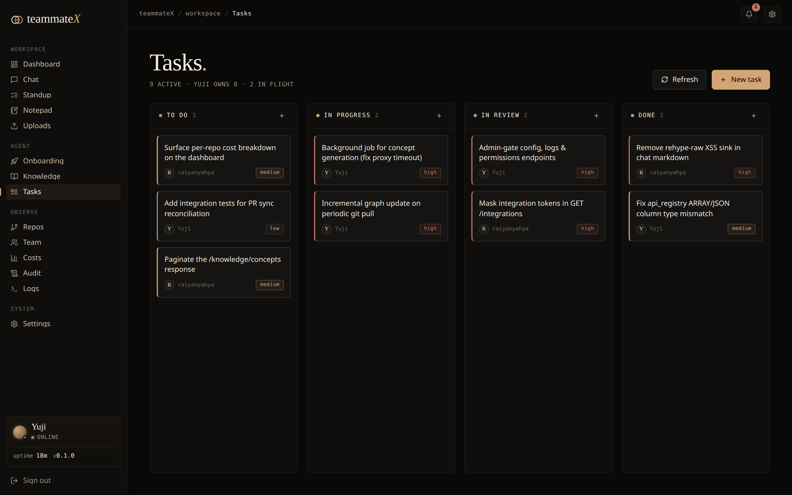</p>

### 6. Standup

Standup as a **deterministic product surface**, not an LLM gamble. The `/standup` page renders three real columns:

- **Yesterday** — pull requests that moved.
- **Today** — open/in-flight tasks.
- **Blockers** — actual `BlockedTask` rows.

It can also be posted to Slack on a schedule.

<p align="center">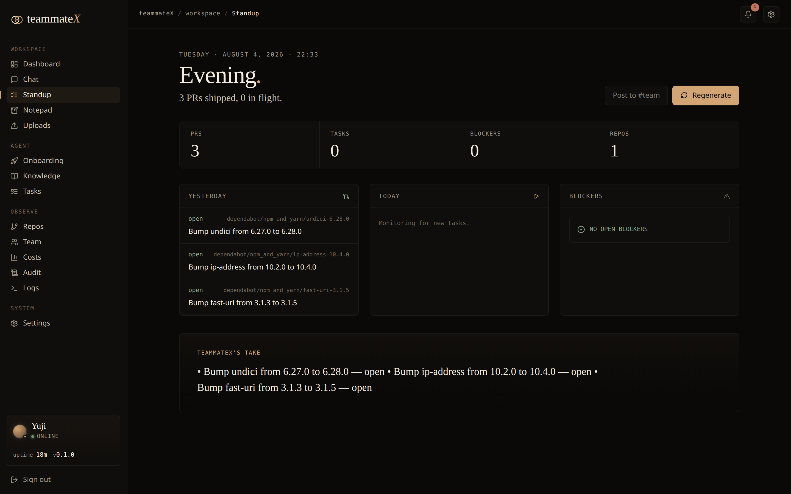</p>

### 7. Team & ownership

The **Team** page lists your AI teammate plus every human contributor **discovered from git history** — each with files owned, repos touched, and inferred languages/expertise. One row per person (duplicate git identities and multi-email contributors are merged), so the headcount is honest.

<p align="center">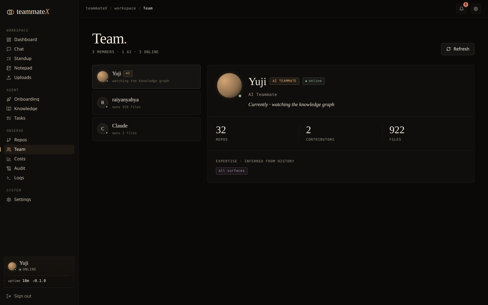</p>

### 8. Repos management

The **Repos** page shows every watched repository with file counts (from the graph), open-PR counts, onboarding progress, and a computed **health** score. Add, bulk-add, retry onboarding, or remove a repo (which cleans up its DB rows, on-disk clone, and graph subgraph).

<p align="center">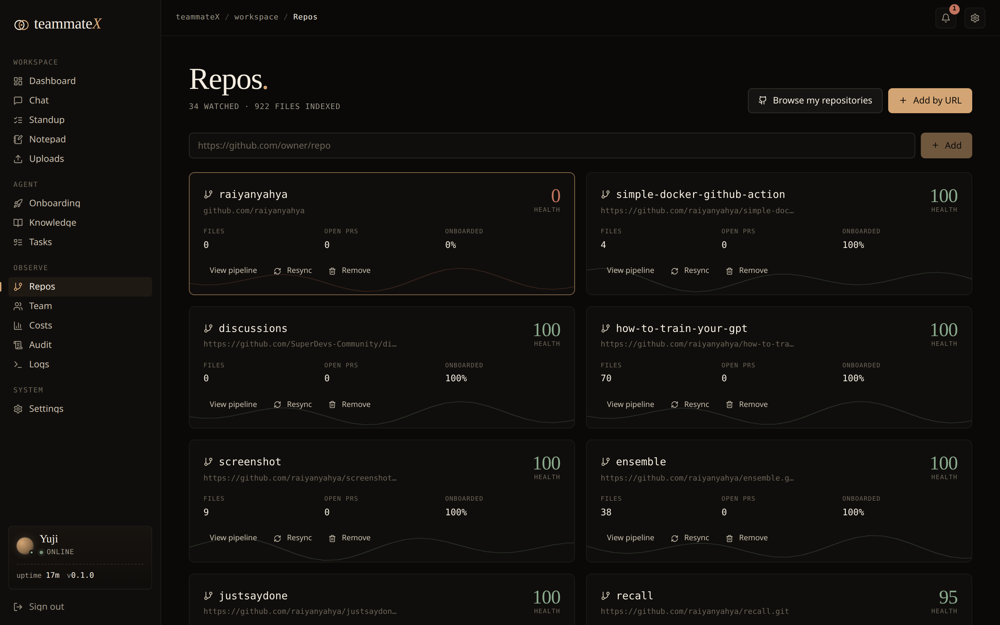</p>

### 9. Costs & budget

Every LLM call is metered — **all of them**, not just chat: onboarding, concept extraction, proactive tasks, Slack answers, and plan/generate/review all log their token usage centrally, so the dashboard reflects true spend. On top of the per-call log you get:

- **Period toggle** — view tokens and spend for **today / 7d / 30d / all-time**.
- **Spend by activity** — a breakdown of where the tokens go (chat vs onboarding vs concept extraction vs …).
- **Budget guardrail** — set an optional monthly USD and/or token limit (`PUT /api/config/cost_budget` with `{"monthly_usd_limit": 25, "monthly_token_limit": 5000000}`); the dashboard shows a progress bar that turns amber at 80% and red once you're over, so a self-hosted agent never becomes a surprise bill.

<p align="center">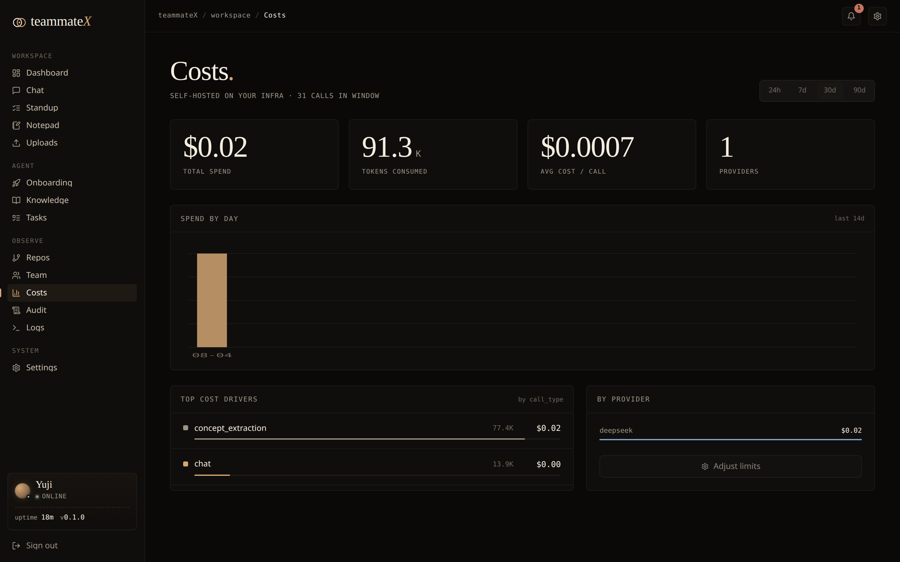</p>

### 10. Audit log

A first-class, queryable record of agent actions — what it did, when, status, and a summary — surfaced on the **Audit** page and the dashboard's "recent runs."

<p align="center">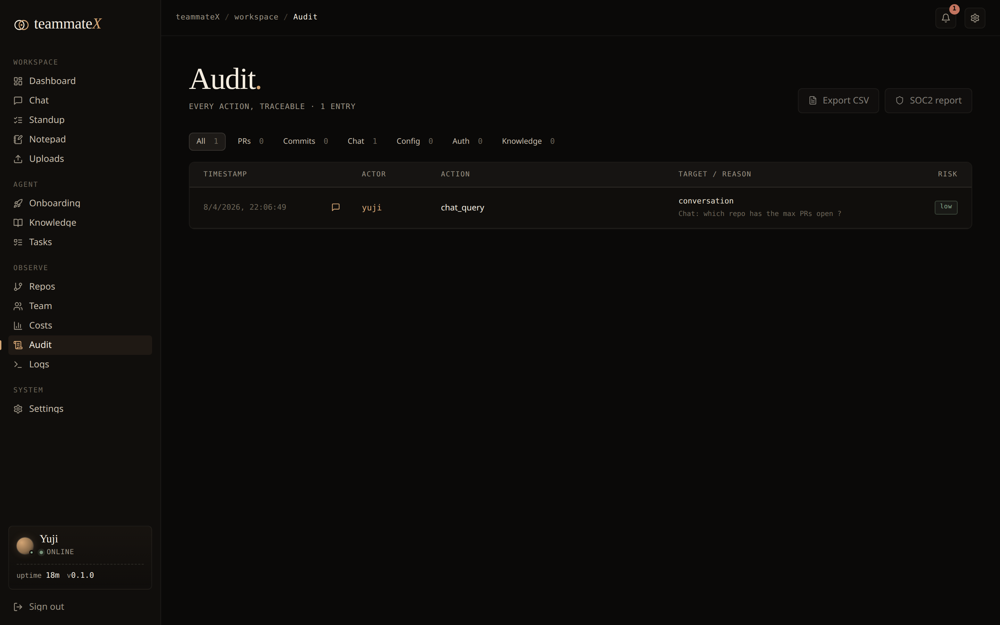</p>

### 11. Live logs

The **Logs** page tails real container logs (api, worker, frontend, postgres, neo4j) straight from the Docker socket, with **per-level filters** (INFO / OK / WARN / ERR / DBG), service switching, and pause/resume — a built-in `docker logs -f` for operators who don't want to SSH in.

<p align="center">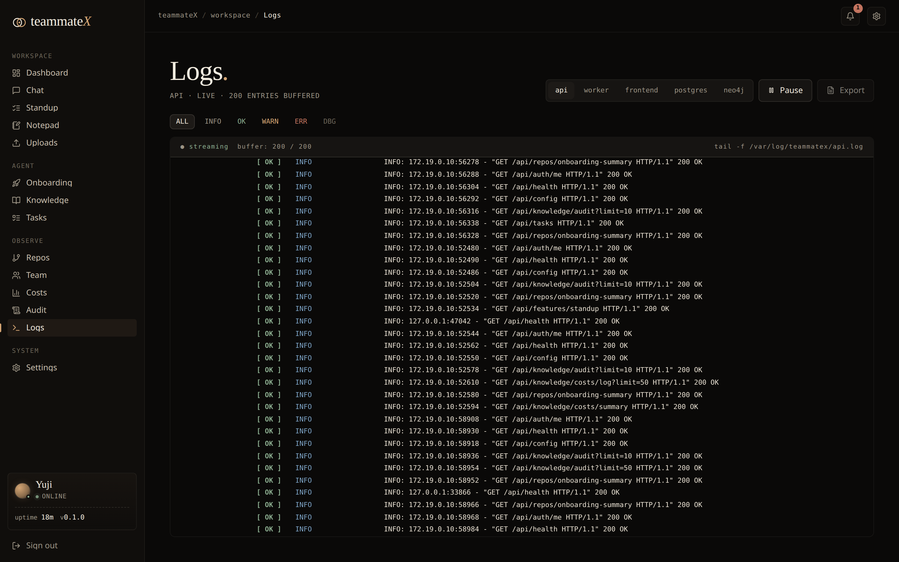</p>

### 12. Knowledge (concept cards)

The **Knowledge** page renders LLM-extracted **concept cards** (auth, billing, queueing, etc.) drawn from the graph — a high-level, human-readable map of the subsystems the teammate has learned, plus notes.

<p align="center">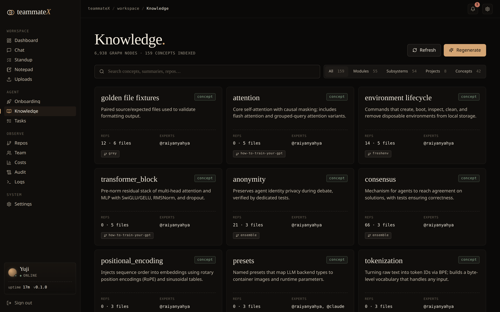</p>

### 13. Settings & integrations

- **LLM** — see and switch the active provider/model; keys stored server-side and **masked** on read (never echoed back).
- **GitHub** — connect a token; the UI shows *"Connected as `<login>`"* and whether the token can push. Powers repo listing, PR sync, and PR creation.
- **Jira** — projects, boards, sprints, active-sprint endpoints.
- **Slack** — channel listing and message posting.
- **Setup checklist** — the dashboard shows a readiness card (LLM provider, GitHub, Jira, Slack), so a half-configured instance is obvious at a glance instead of failing silently.

Controls that aren't wired yet are honestly disabled with a note, rather than pretending to work.

<p align="center">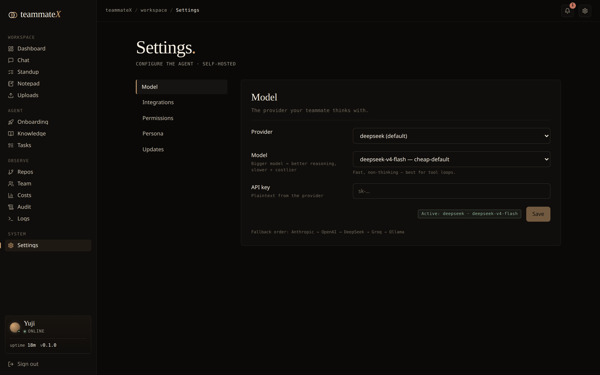</p>

### 14. Auto-sync (keeping the brain fresh)

A background poller (Celery beat, every 15 min) periodically re-syncs each repo: it **`git pull`s the latest commits** on the repo's real default branch, ingests new pull requests, and incrementally updates the graph — so the teammate's knowledge tracks reality without a manual re-onboard. The default branch is **detected at onboarding** (e.g. `main` vs `master`) and the pull falls back to whatever branch the clone is actually on, so a mis-recorded branch can't silently stall sync. Webhook-driven sync is also supported. The dashboard shows each repo's real **last-synced** time and flags anything stale (>24h) in amber.

### 14b. Weekly digest delivery

The weekly digest (actions, repo status, LLM usage, recent notes) can be **delivered to Slack automatically** — Celery beat runs it every Monday 09:00 UTC, posting to the channel set in `digest_settings.slack_channel`. Trigger it on demand with `POST /api/reports/digest/send`. With no Slack configured it's a harmless no-op.

### 15. Observability stack

Batteries included for running this for real: **Prometheus** (metrics), **Grafana** (dashboards), **Loki + Promtail** (log aggregation), **Flower** (Celery task monitor), and **node-exporter** — all wired in the compose file and toggleable.

### 16. Notepad

A per-developer scratchpad at **`/notepad`** — a black, full-height editor that **autosaves** as you type (no Save button). One private note per user, persisted server-side, so it survives reloads and follows you across sessions.

<p align="center">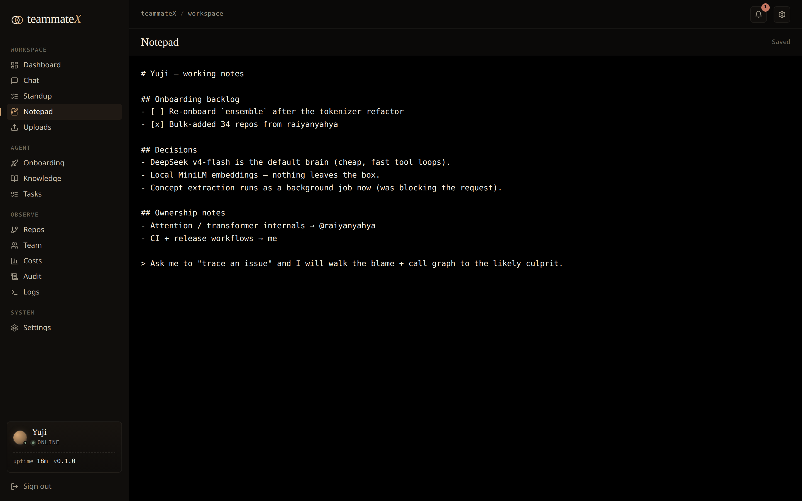</p>

### 17. Uploads

A private file area at **`/uploads`** where each developer can **drag-and-drop or pick files** (up to 25 MB), then download or delete them later. Files are scoped to the uploader (no one else sees them), stored under a generated name so the original filename can't traverse the filesystem, and always served as attachments. **Store-only — uploaded files are never executed.**

<p align="center">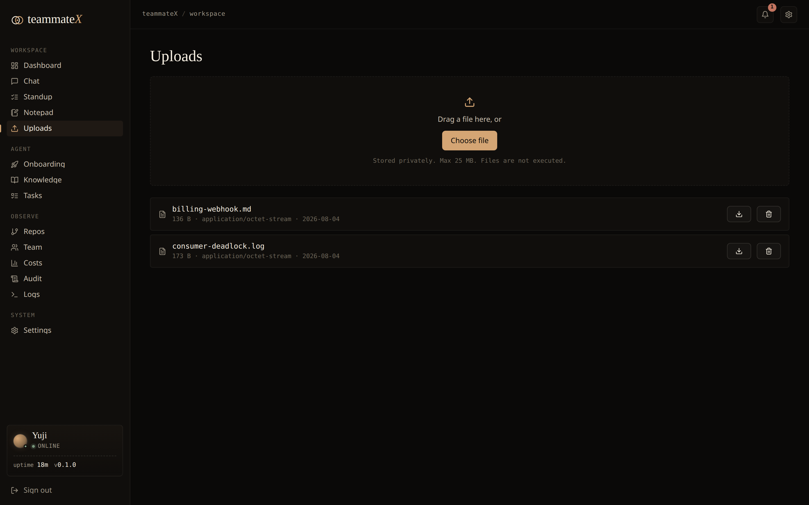</p>

---

## 🏗 Architecture

```
                            ┌──────────────────────────────────┐
        Browser  ──TLS──▶   │  Caddy   (reverse proxy :80/:443) │
                            └───────────────┬──────────────────┘
                            /api/*          │          everything else
                     ┌──────────────────────┼───────────────────────┐
                     ▼                                               ▼
            ┌─────────────────┐                          ┌────────────────────┐
            │  FastAPI  :8000 │                          │  Next.js 14  :3000 │
            │  (REST + auth)  │                          │  (App Router UI)   │
            └────────┬────────┘                          └────────────────────┘
                     │
   ┌─────────────────┼───────────────────────────────────────────┐
   ▼                 ▼                  ▼                ▼          ▼
┌────────┐    ┌─────────────┐    ┌───────────┐   ┌──────────┐  ┌──────────┐
│Postgres│    │   Neo4j     │    │  Redis    │   │  Celery  │  │ cloned   │
│pgvector│    │ knowledge   │    │ broker +  │   │ worker + │  │ repos    │
│ + ORM  │    │   graph     │    │  cache    │   │  beat    │  │ /data    │
└────────┘    └─────────────┘    └───────────┘   └──────────┘  └──────────┘

LLM via LiteLLM ──▶  DeepSeek · OpenAI · Anthropic · Groq · Ollama (local)
Observability    ──▶  Prometheus · Grafana · Loki/Promtail · Flower · node-exporter
```

- **Backend:** FastAPI + SQLAlchemy (async) + Celery, Python 3.12.
- **Data:** PostgreSQL with **pgvector** (relational + embeddings), **Neo4j** (graph), **Redis** (broker/cache).
- **Frontend:** Next.js 14 (App Router) + Tailwind, a custom editorial "paper-on-ink" design language.
- **LLM:** LiteLLM multi-provider abstraction.
- **Infra:** Docker Compose, Caddy (auto-TLS), full monitoring stack.

---

## 🧰 The agent's toolbox

The teammate ships with **28 curated tools** across five families. It chooses which to call.

| Family | Tools |
|---|---|
| **Files** | `read_file`, `write_file`, `edit_file`, `list_directory`, `glob_search`, `grep_search` |
| **Git / GitHub** | `create_branch`, `commit_files`, `create_pr`, `get_diff`, `get_blame`, `get_commit_log`, `list_prs` |
| **Knowledge** | `semantic_search`, `graph_query`, `find_owner`, `find_dependents`, `find_dependencies`, `get_architecture`, `trace_issue` |
| **Memory** | `write_note`, `search_notes` |
| **Execution & web** | `run_command`, `run_tests`, `run_lint`, `http_request`, `schedule_task`, `web_search` |

---

## 🖥 Installing on a server (production)

A reference deployment on a single Linux VM (Ubuntu 22.04+, 4 vCPU / 8 GB RAM / 40 GB disk is comfortable).

### 1. Install Docker

```bash
curl -fsSL https://get.docker.com | sh
sudo usermod -aG docker "$USER" && newgrp docker     # run docker without sudo
docker compose version                               # confirm Compose v2
```

### 2. Get the code

```bash
git clone <your-fork-url> /opt/teammatex
cd /opt/teammatex
cp .env.example .env
```

### 3. Configure `.env` — the non-negotiables

```bash
# A STRONG random signing key — anything else is a security hole (see Security).
sed -i "s|^TEAMMATEX_SECRET_KEY=.*|TEAMMATEX_SECRET_KEY=$(python3 -c 'import secrets;print(secrets.token_urlsafe(48))')|" .env

# Then edit .env to set strong DB passwords and at least one LLM key:
#   POSTGRES_PASSWORD=<random>
#   NEO4J_PASSWORD=<random>
#   DEEPSEEK_API_KEY=sk-...        (or OPENAI_/ANTHROPIC_/GROQ_, or Ollama)
```

### 4. Point Caddy at your domain (automatic HTTPS)

Caddy is already the front door (ports 80/443). Set your hostname in `docker/Caddyfile` (replace the local placeholder with `teammatex.example.com`). Caddy provisions a Let's Encrypt certificate automatically on first request — just make sure DNS `A`/`AAAA` records point at the box and ports 80/443 are open.

### 5. Launch

```bash
docker compose up -d --build
```

A one-shot `migrate` service runs `alembic upgrade head` and exits before the API and workers start, so the stack **self-migrates on every `up`** — no manual migration step, on first launch or after an upgrade.

### 6. First login & hardening

```bash
docker compose logs api | grep -A4 "first run"       # grab the generated admin password
```

Log in at `https://teammatex.example.com`, **change the admin password immediately** (Settings), and add your LLM + GitHub keys through the UI (they're stored in the DB, masked on read).

### 7. Operating it

```bash
docker compose ps                 # health of every service
docker compose logs -f api        # follow logs (or use the in-app Logs page)
docker compose pull && docker compose up -d   # update images (auto-migrates on start)

# Backups — the stateful volumes:
#   postgres_data · neo4j_data · cloned_repos · uploads_data · grafana_data · caddy_data
docker run --rm -v teammatex_postgres_data:/data -v "$PWD":/backup alpine \
  tar czf /backup/postgres-$(date +%F).tgz -C /data .
```

> **Ports:** Caddy `80/443` (public), Frontend `3000`, API `8000`, Caddy admin `2019`. In production, expose only 80/443 publicly and firewall the rest.

---

## ⚙️ Configuration reference (`.env`)

| Variable | Default | What it does |
|---|---|---|
| `TEAMMATEX_NAME` | `Dev` | Display name of your teammate |
| `TEAMMATEX_PERSONA` | `helpful_senior_dev` | Working-style persona |
| **`TEAMMATEX_SECRET_KEY`** | `change-me…` | **JWT signing key — set a strong random 32+ char value** |
| `POSTGRES_HOST/PORT/DB/USER/PASSWORD` | `postgres` / … | PostgreSQL + pgvector connection |
| `TEAMMATEX_NEO4J_URI` | `bolt://neo4j:7687` | Neo4j connection |
| `NEO4J_USER` / `NEO4J_PASSWORD` | `neo4j` / … | Neo4j credentials |
| `REDIS_URL` | `redis://redis:6379/0` | Celery broker + cache |
| `OPENAI_API_KEY` / `OPENAI_MODEL` | – / `gpt-4o` | OpenAI provider |
| `ANTHROPIC_API_KEY` / `ANTHROPIC_MODEL` | – | Anthropic provider |
| `DEEPSEEK_API_KEY` / `DEEPSEEK_MODEL` | – | DeepSeek provider (cost-effective default) |
| `OLLAMA_BASE_URL` / `OLLAMA_MODEL` | `…11434` / `llama3.1:8b` | Local model, no key required |
| `GROQ_API_KEY` / `GROQ_MODEL` | – | Groq provider |
| `EMBEDDING_PROVIDER` | `local` | `local` (MiniLM, free) or `openai` |
| `EMBEDDING_MODEL` | `all-MiniLM-L6-v2` | Embedding model |
| `GITHUB_CLIENT_ID/SECRET`, `GITHUB_WEBHOOK_SECRET` | – | GitHub integration & webhooks |
| `JIRA_URL` / `JIRA_EMAIL` / `JIRA_API_TOKEN` | – | Jira integration |
| `SLACK_BOT_TOKEN` / `SLACK_SIGNING_SECRET` / `SLACK_APP_TOKEN` | – | Slack integration |
| `PROMETHEUS_ENABLED` | `true` | Enable Prometheus instrumentation of the API |
| `TEAMMATEX_METRICS_TOKEN` | – | Bearer token required to read `/metrics`. **Unset → `/metrics` is not exposed at all.** Set it (and the matching value in `docker/prometheus.yml`) to let Prometheus scrape |
| `GRAFANA_ADMIN_PASSWORD` | `admin` | Grafana login |
| `COOKIE_SECURE` | `false` | Set `true` in production (HTTPS) so the session cookie carries the `Secure` flag |

> 💡 LLM provider keys and the GitHub token can also be set **at runtime through the UI** (stored in `app_config`, masked on read) — handy for rotating without redeploying.

---

## 🔒 Security

- **Authenticated API.** Every data/mutation endpoint requires a logged-in user. Auth travels as an **HttpOnly, `SameSite=Lax` cookie** (set at login, invisible to JavaScript → XSS can't steal it) or an `Authorization: Bearer <jwt>` header for programmatic clients. `/health` and webhook endpoints (signature-verified) are intentionally public.
- **Set a strong `TEAMMATEX_SECRET_KEY`.** JWTs are HMAC-signed with it. The default `change-me` is public — anyone could forge a token. Generate one with `python3 -c "import secrets; print(secrets.token_urlsafe(48))"`.
- **Secrets are masked.** `GET /api/config` never echoes stored API keys/tokens back to the client.
- **Account creation is admin-only.** The first-run bootstrap creates the initial admin; `POST /auth/register` then requires an authenticated **admin**, so a reachable API can't be self-registered into. `/metrics` is likewise off unless you set `TEAMMATEX_METRICS_TOKEN`.
- **Self-hosted.** Code, embeddings, and graph stay on your infrastructure. With local embeddings + a local Ollama model, **nothing leaves the box.**
- **Webhooks are signature-verified** (GitHub/Slack), not user-authed.

See [`SECURITY.md`](SECURITY.md) for the disclosure policy and hardening notes.

---

## 👩‍💻 Development

```bash
# Full stack with hot-reload helpers
./scripts/dev.sh

# Backend only
cd backend && poetry install && poetry run uvicorn app.main:app --reload

# Frontend only
cd frontend && npm install && npm run dev
```

**Tests** run inside the API container against a real ephemeral Postgres + Neo4j (per-test transaction rollback):

```bash
# The production image omits test deps — install them once:
docker compose exec api pip install -q pytest 'pytest-asyncio>=0.26' factory-boy
docker compose exec api python -m pytest -q
```

> **Dev loop note:** application code is **baked into the image** (no bind mount). For a quick change: `docker cp <file> teammatex-api-1:/app/...` then `docker compose restart api`. To persist: `docker compose build api worker frontend`.

### Continuous integration & delivery

Three GitHub Actions workflows run on every push and PR to `master` (badges at the top of this README):

| Workflow | File | What it does |
|---|---|---|
| **CI** | [`ci.yml`](.github/workflows/ci.yml) | Backend: `ruff` + `black` + `mypy` (advisory) + `pytest` against **real Postgres/pgvector + Neo4j** service containers. Frontend: `eslint` + `tsc --noEmit` + `next build`. |
| **CodeQL** | [`codeql.yml`](.github/workflows/codeql.yml) | SAST security scanning for Python and TypeScript/JavaScript (also weekly); findings land in the repo's **Security** tab. |
| **Docker** | [`docker.yml`](.github/workflows/docker.yml) | Builds the `api`, `worker`, and `frontend` images on every PR; on push to `master` or a `v*` tag, publishes them to **GHCR** (`ghcr.io/<owner>/teammatex-<component>`) with layer caching. |

---

## 📡 API overview

Interactive docs at **`/docs`** (Swagger) and **`/redoc`**. A taste of the surface (all under `/api`):

| Area | Endpoints |
|---|---|
| **Auth** | `POST /auth/login` · `POST /auth/logout` · `POST /auth/register` *(admin-only)* · `GET /auth/me` · `POST /auth/change-password` |
| **Agent** | `POST /agent/chat` · `POST /agent/plan` · `POST /agent/validate` · `GET /agent/tools` |
| **Repos** | `GET /repos` · `POST /repos` · `POST /repos/bulk` · `GET /repos/activity` · `GET /repos/onboarding-summary` · `GET /repos/{id}/onboarding` · `POST /repos/{id}/retry` |
| **Knowledge** | `GET /knowledge/contributors` · `GET /knowledge/concepts` · `POST /knowledge/search` · `GET /knowledge/suggested-questions` · `GET /knowledge/graph/*` · `GET /knowledge/costs/summary?period=today\|7d\|30d\|all` |
| **Conversations** | `GET /conversations?q=` (search) · `GET /conversations/{id}` · `GET /conversations/{id}/export` (Markdown) · `DELETE /conversations/{id}` |
| **Tasks** | `GET /tasks` · `POST /tasks` · `PATCH /tasks/{id}` · `DELETE /tasks/{id}` |
| **Workspace** | `GET/POST/DELETE /uploads` · `GET /uploads/{id}/download` · `GET/POST /notepad` |
| **Reports** | `GET /reports/digest` · `GET /reports/digest/markdown` · `POST /reports/digest/send` |
| **Integrations** | `GET /integrations/status` · `GET /integrations/health` · `GET /integrations/github/repos` · `GET /integrations/jira/*` · `GET /integrations/slack/channels` |
| **Ops** | `GET /health` · `GET /logs/{service}` · `GET /config` · `PUT /config/{key}` (incl. `cost_budget`, `digest_settings`) |

---

## ❓ FAQ

<details>
<summary><strong>Does my source code leave my servers?</strong></summary>

No. TeammateX clones and analyzes everything **locally**. The only thing that can leave is whatever you send to your chosen LLM provider on a chat turn — and even that you can eliminate by running a **local Ollama model** with **local embeddings** (the default). In a fully-local setup, nothing leaves the box.
</details>

<details>
<summary><strong>Which LLM should I use?</strong></summary>

Any of OpenAI, Anthropic, DeepSeek, Groq, or a local Ollama model — it's a one-line config via LiteLLM. **DeepSeek** is the cost-effective default for agentic tool loops. For maximum capability, use a frontier OpenAI/Anthropic model. For maximum privacy/zero-cost, use Ollama locally.
</details>

<details>
<summary><strong>What languages can it understand?</strong></summary>

Parsing is tree-sitter-based, covering Python, JavaScript/TypeScript, Go, Rust, Java, and more. Call-graph extraction is strongest for the mainstream languages; semantic search and ownership work for any text-based repo.
</details>

<details>
<summary><strong>How big a repo / how many repos can it handle?</strong></summary>

It's designed for real monorepos and multi-repo orgs — the reference instance in the screenshots has indexed **54 repos, ~100 contributors, and 8,800+ concepts.** Onboarding is incremental and resumable; embeddings are chunked and stored in pgvector. Scale RAM/disk with corpus size.
</details>

<details>
<summary><strong>Can it actually open pull requests?</strong></summary>

Yes — it runs `git` and `gh` itself (`create_branch` → `commit_files` → `create_pr`). It needs a GitHub token with **write** scope (Contents + Pull requests, or classic `repo`). A read-only token lets it clone and read but `git push` will 403.
</details>

<details>
<summary><strong>Why both PostgreSQL and Neo4j?</strong></summary>

Different jobs. **pgvector** answers *"what code is semantically similar to this question?"* **Neo4j** answers *structural* questions — *"what calls this function?"*, *"who owns this file?"*, *"what's the dependency blast radius?"* Vector search guesses by meaning; the graph knows by structure. Together they keep the teammate grounded.
</details>

<details>
<summary><strong>The dashboard says "0 repos" / data looks empty.</strong></summary>

You probably haven't onboarded a repo yet — add one via **Onboarding**. Watch progress per-stage; the dashboard fills in once the graph and embeddings exist. (Migrations run automatically on `up` via the one-shot `migrate` service, so an empty DB usually isn't the cause.)
</details>

<details>
<summary><strong>I changed `TEAMMATEX_SECRET_KEY` and everyone got logged out.</strong></summary>

Expected. JWTs are signed with that key — rotating it invalidates existing sessions. Everyone just logs in again. Do this rotation **once**, with a strong value, before going live.
</details>

<details>
<summary><strong>How do I update to a new version?</strong></summary>

```bash
git pull && docker compose up -d --build
```
The one-shot `migrate` service applies any new DB migrations automatically before the API starts — no manual `alembic` step needed.
</details>

<details>
<summary><strong>How do I back it up?</strong></summary>

Snapshot the named volumes: `postgres_data`, `neo4j_data`, `cloned_repos`, plus `grafana_data`/`caddy_data` if you care about dashboards/certs. See the `docker run … tar` example in the install section.
</details>

<details>
<summary><strong>Is there a hosted/SaaS version?</strong></summary>

TeammateX is **self-hosted first** — that's the privacy story. Run it on your own VM or inside your VPC.
</details>

---

## 📄 License

Released under the [MIT License](LICENSE) — © 2026 Raiyan Yahya. Use it, fork it, ship it; just keep the copyright notice.

## 🤝 Contributing

Contributions are very welcome — this is alpha, so it's the best time to shape the project. Start with the [Contributing guide](CONTRIBUTING.md), and please be kind per our [Code of Conduct](CODE_OF_CONDUCT.md). Found a security issue? See [SECURITY.md](SECURITY.md) and report it privately.

---

<div align="center">

**Built to be a teammate, not a chatbot.**

*FastAPI · Next.js · PostgreSQL/pgvector · Neo4j · Celery · Docker*

</div>
